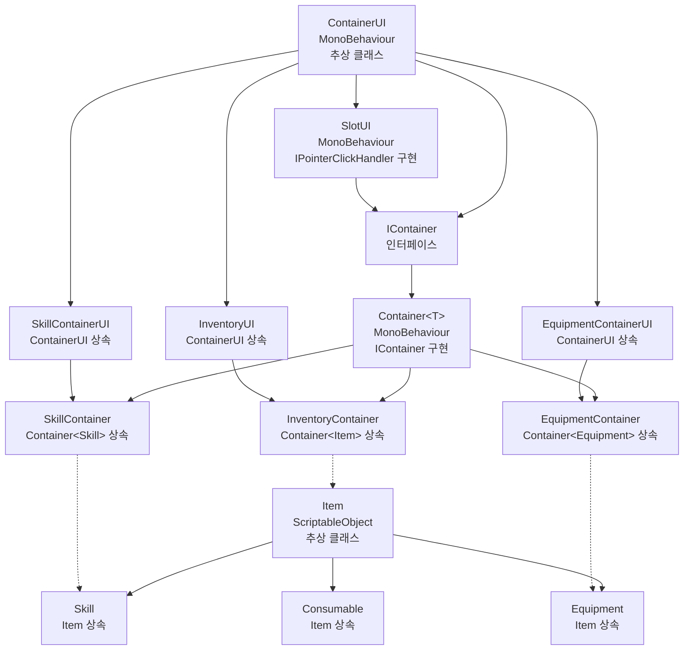

# 인벤토리 시스템 아키텍처 분석

## 클래스 관계도



## 시스템 구조 분석

### 1. 아이템 계층 (Item Hierarchy)

#### Item (추상 클래스)
- **역할**: 모든 아이템의 기본 클래스
- **특징**: 
  - `ScriptableObject`를 상속하여 Unity 에디터에서 에셋으로 생성 가능
  - 모든 아이템의 공통 속성 정의 (id, itemName, icon, description)
  - `Use()` 메서드를 통해 런타임 액션 훅 제공
- **위치**: `Assets/Scripts/Inventory/SO/ItemSO.cs`

#### Skill (Item 상속)
- **역할**: 스킬 아이템 구현
- **특징**:
  - `cooldown` 속성으로 쿨다운 관리
  - `Execute()` 메서드로 스킬 실행 로직 구현
  - `Use()` 메서드를 `Execute()`로 오버라이드
- **위치**: `Assets/Scripts/Inventory/SO/SKillSO.cs`

#### Equipment (Item 상속)
- **역할**: 장비 아이템 구현
- **특징**:
  - `equipmentSlot` 속성으로 장비 슬롯 타입 구분 (무기, 방어구 등)
  - 장비 특화 로직 확장 가능
- **위치**: `Assets/Scripts/Inventory/SO/EquipmentSO.cs`

#### Consumable (Item 상속)
- **역할**: 소모품 아이템 구현
- **특징**:
  - `Amount` 속성으로 효과량 정의
  - `Heal()` 메서드로 회복 효과 구현
  - `Use()` 메서드에서 자동으로 회복 효과 실행
- **위치**: `Assets/Scripts/Inventory/SO/ConsumableSO.cs`

### 2. 컨테이너 계층 (Container Hierarchy)

#### IContainer (인터페이스)
- **역할**: 모든 컨테이너의 공통 계약 정의
- **핵심 기능**:
  - 아이템 접근/설정 메서드 (`GetItem`, `SetItem`)
  - 아이템 수용 가능성 검사 (`CanAccept`)
  - 통합 이동/스왑 메서드 (`TryMoveOrSwap`)
  - 원자 연산 API (`BeginAtomicOperation`, `EndAtomicOperation`)
  - 변경 알림 시스템 (`OnChanged` 이벤트)
- **위치**: `Assets/Scripts/Interface/IContainer.cs`

#### Container<T> (제네릭 클래스)
- **역할**: 타입 안전한 컨테이너 구현체
- **특징**:
  - 제네릭 타입 `T`로 특정 아이템 타입만 수용
  - 원자 연산을 통한 안전한 아이템 이동/스왑
  - 동시성 제어를 위한 `inAtomicOperation` 플래그
  - 이벤트 기반 변경 알림 시스템
- **위치**: `Assets/Scripts/Inventory/Contianers/Container.cs`

#### 특화 컨테이너들
- **InventoryContainer**: 모든 아이템 타입 수용 (`Container<Item>`)
- **SkillContainer**: 스킬만 수용 (`Container<Skill>`), 스킬 사용 API 제공
- **EquipmentContainer**: 장비만 수용 (`Container<Equipment>`)

### 3. UI 계층 (UI Hierarchy)

#### ContainerUI (추상 클래스)
- **역할**: 컨테이너 UI의 기본 구현
- **핵심 기능**:
  - 슬롯 풀링 시스템으로 성능 최적화
  - 컨테이너 바인딩 및 변경 감지
  - 클릭 기반 아이템 이동/스왑 처리
  - 슬롯 생성 및 관리
- **위치**: `Assets/Scripts/Inventory/ContainerUI/ContainerUI.cs`

#### SlotUI (구체 클래스)
- **역할**: 개별 슬롯의 UI 표현
- **특징**:
  - `IPointerClickHandler` 구현으로 클릭 이벤트 처리
  - 아이템 아이콘 표시 및 업데이트
  - 컨테이너와 인덱스 정보 관리
- **위치**: `Assets/Scripts/Inventory/ContainerUI/SlotUI.cs`

#### 특화 UI 클래스들
- **InventoryUI**: 인벤토리 전용 UI 로직
- **SkillContainerUI**: 스킬 컨테이너 전용 UI, 키보드 단축키 지원
- **EquipmentContainerUI**: 장비 컨테이너 전용 UI, 슬롯 타입 표시

## 시스템의 핵심 설계 원칙

### 1. 타입 안전성 (Type Safety)
- 제네릭을 활용한 컴파일 타임 타입 검사
- 각 컨테이너가 특정 아이템 타입만 수용하도록 제한

### 2. 원자 연산 (Atomic Operations)
- `TryMoveOrSwap` 메서드를 통한 안전한 아이템 이동
- 동시성 제어를 통한 데이터 일관성 보장

### 3. 이벤트 기반 아키텍처
- `OnChanged` 이벤트를 통한 느슨한 결합
- UI와 데이터 모델 간의 자동 동기화

### 4. 확장성 (Extensibility)
- 인터페이스 기반 설계로 새로운 컨테이너 타입 추가 용이
- 추상 클래스를 통한 공통 기능 재사용

### 5. 성능 최적화
- 슬롯 풀링을 통한 메모리 효율성
- 이벤트 기반 업데이트로 불필요한 리프레시 방지

## 사용 예시

```csharp
// 스킬 사용
skillContainer.Use(0, playerObject);

// 아이템 이동/스왑
inventoryContainer.TryMoveOrSwap(0, equipmentContainer, 1);

// UI 바인딩
inventoryUI.Bind(inventoryContainer);
```

이 아키텍처는 Unity 게임 개발에서 일반적인 인벤토리 시스템의 요구사항을 충족하면서도, 확장 가능하고 유지보수가 용이한 구조를 제공합니다.
